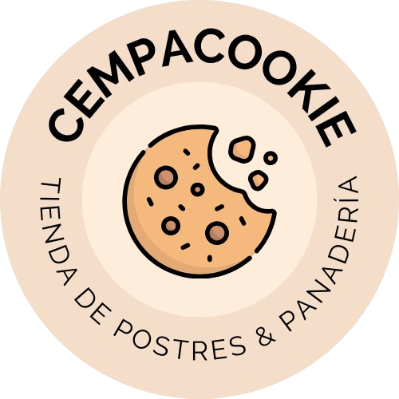

<div align="center">
    
    <h1>🍪 Cempacookie 🍪</h1>
    <h2>Bakery & Pastry Landing Page</h2>
</div>

<i align="center">
🎂✨🥖 Cempacookie is a responsive landing page for a bakery and pastry shop, created as the final project of a web development course. The website showcases a modern and visually appealing design while being fully responsive for seamless use across devices. 🎂✨🥖
</i>

## Features 💡

- **Responsive Design**: Ensures a consistent and enjoyable user experience on desktops, tablets, and mobile devices.
- **Hand-Coded**: Built from scratch using only **HTML5**, **CSS3**, and **JavaScript** without relying on frameworks.
- **Modern Aesthetics**: Highlights the unique branding and delicious offerings of Cempacookie.

## Purpose 🎯

This project demonstrates core web development skills, including semantic HTML, custom CSS styling, and interactive JavaScript features. It is designed to emulate a real-world product for a bakery or pastry business.

## Links 🔗

- **Live Demo**: [https://mariomttz.github.io/cempacookie/](https://mariomttz.github.io/cempacookie/)
- **Course**: [Web Development from Scratch: HTML5, CSS3, and JavaScript](https://www.udemy.com/course/desarrollo-web-desde-cero-html5-css3-javascript)

## Installation ⚙️

1. Clone the repository:

```bash
git clone https://github.com/mariomttz/cempacookie.git
```

2. Open the `index.html` file in your browser to view the site.

## Screenshots 📸

> [!IMPORTANT]
> Some of the images used in this project were generated with AI. For more details, visit the documentation at [docs/images.md](docs/images.md). 🔍

## License 📜

This project is licensed under the [GPL-3.0 license](https://github.com/mariomttz/cempacookie?tab=GPL-3.0-1-ov-file). Feel free to use, modify, and distribute it as per the license terms.

## Contact 💬

Feel free to reach out via the repository if you have questions or feedback!
